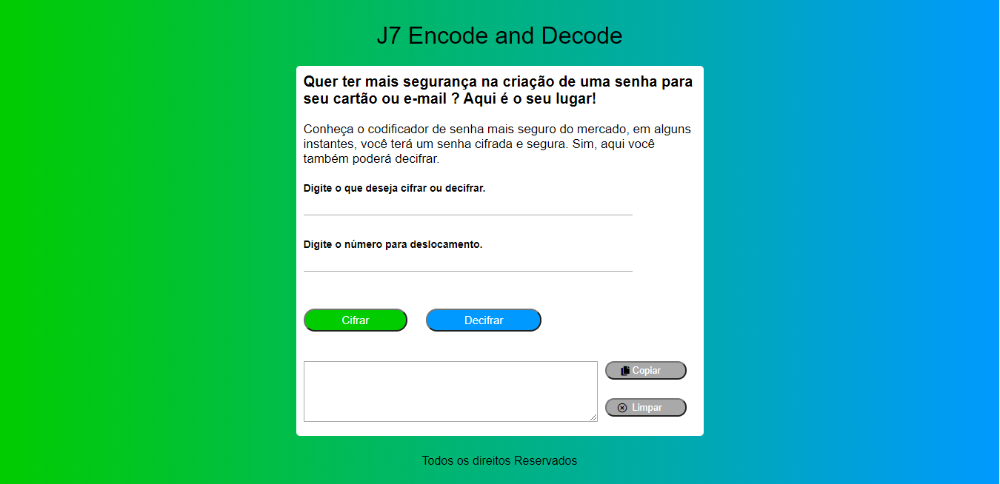

# Cifra de César

## 1. Prefácio

Cifrar significa codificar. A [cifra de César](https://pt.wikipedia.org/wiki/Cifra_de_C%C3%A9sar) é um dos primeiros
tipos de criptografias conhecidas na história. O imperador romano Júlio César
utilizava essa cifra para enviar ordens secretas aos seus generais no campo de
batalha.

A cifra de César é uma das técnicas mais simples de cifrar uma mensagem. É um
tipo de cifra por substituição, em que cada letra do texto original é
substituida por outra que se encontra há um número fixo de posições
(deslocamento) mais a frente do mesmo alfabeto.

Por exemplo se usarmos o deslocamento (_offset_) de 3 posições:

* Alfabeto sem cifrar: A B C D E F G H I J K L M N O P Q R S T U V W X Y Z
* Alfabeto com cifra:  D E F G H I J K L M N O P Q R S T U V W X Y Z A B C
* A letra A será D
* A palavra CASA será FDVD

Atualmente todas as cifras de substituição alfabética simples, são decifradas
com facilidade e não oferecem muita segurança na comunição, mas a cifra de César muitas vezes pode fazer parte de um sistema mais complexo de criptografia, como a cifra de Vigenère, e tem aplicação no sistema ROT13.

## 2. Resumo do projeto

A empresa (fictícia) J7 Encode and Decode foi criada para trazer segurança, modernidade e agilidade para usuários que buscam codificar senhas para cartão ou e-mail. Caso precise decodificar sua senha também poderá fazer.
A empresa (fictícia) J7 Encode and Decode utiliza de uma das codificações mais segura e antiga, a famosa Cifra de César, que foi apresentada acima.

## 3. Planejamento

A interface da J7 Encode and Decode foi desenhada inicialmente em uma folha de caderno, onde o nome da empresa ficaria no topo e centralizado, no meio da página e centralizado teríamos o nosso codificador/decodificador, onde temos os campos de input e o retorno da codificação/decodificação e por fim um rodapé também centralizado. Por seguinte, foi destrinchado o que deveria ser feito e divididos em tasks no Trello.
Os primeiros passos para a realização da interface poder ser vista no browser foram: criação do html, construção das funções para Codificar e Decodificar em javascript, interação do javascript com o HTML via Dom e para finalizar a estilização da página com CSS.

### Ferramentas utilizadas:

Para construção da nossa aplicação foram utilizadas as seguintes ferramentas:

* 
* 
* 

## 4. Público alvo

Nosso público alvo é todos os usuários que desejam codificar e decodificar senhas para cartões ou e-mail, que buscam segurança nesse processo.
Buscando trazer sempre a melhor experiência aos nossos usuários, temos uma interface muito explicativa e moderna.
A interface permite que o usuário digite uma palavra que deseja cifrar ou decifrar, escolha um deslocamento e clique no botão da função que deseja realizar. Para trazer maior agilidade aos nossos usuários temos um botão para Copiar o que foi cifrado ou decifrado e também um botão para limpar.

## 5. J7 Encode and Decode

✨ Para acessar a aplicação [Clique aqui!](https://jessicacavalcante.github.io/SAP005-cipher/) ✨

Para usar a aplicação é só acessar o link acima, onde possui uma breve explicação sobre os serviços da J7 Encode and Decode.
No primeiro campo, deverá colocar a palavra que deseja cifrar ou decifrar, no segundo campo deverá colocar o deslocamento que deseja para cifrar ou decifrar, clicar no botão da função (Cifrar ou Decifrar) que deseja realizar e no campo abaixo terá o retorno da função.
Caso queira copiar o retorno da função, basta clicar no botão copiar.

### Como rodar localmente

1. Antes de mais nada, se assegure de ter um bom 📝 editor de texto, algo como o Visual Studio Code ou Atom.
2. Para executar os comandos você precisará de um 🐚 UNIX Shell, que é um programa que interpreta linhas de comando (command-line interpreter) e também deve ter o git instalado. Se você usa um sistema operacional "UNIX-like", como GNU/Linux ou MacOS, você já tem um shell (terminal) instalado (e provavelmente o git também). Se você usa Windows pode baixar a versão completa do Cmder que inclue o Git bash, embora seja recomendado que você teste 🐧 GNU/Linux. Se tem Windows 10 ou superior pode usar o Windows Subsystem for Linux.
3. Faça o 🍴 fork desse repositório.
4. ⬇️ Clone o fork para seu computador (cópia local).
5. 📦 Instale as dependências do projeto rodando o comando npm install. Mas antes disso tenha certeza de ter instalado o Node.js (que inclui o npm).
6. Para ver a interface desse programa no navegador, use o comando npm start para iniciar o servidor web e entre na url http://localhost:5000 no seu navegador.
